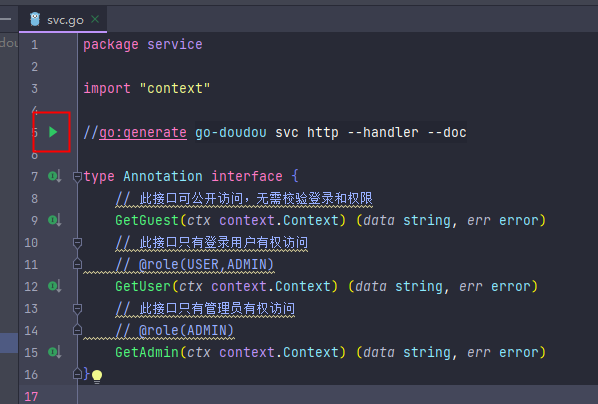
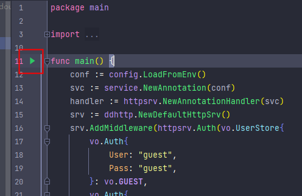
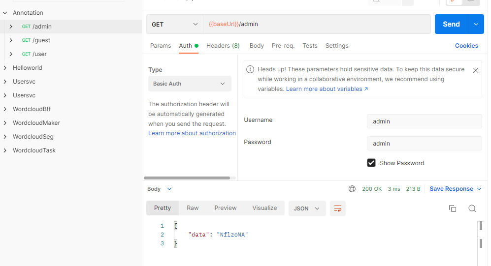

# 如何在go-doudou应用中使用注解

我们都知道go语言没有原生的注解，但是做业务开发有些时候没有注解确实不方便前后端联调。go-doudou通过go语言标准库`ast/parser`实现了对注解的支持。

## 快速上手

我们通过一个简单的基于go-doudou开发的服务来演示用法和效果。

### 准备

- 本地安装最新版go-doudou CLI

```go
go install -v github.com/unionj-cloud/go-doudou/v2@v2.0.6
```

- 本地安装postman，用于测试接口：[https://www.postman.com/](https://www.postman.com/)

- 本地安装goland

### 初始化工程

我们的服务名称和模块名称都叫`annotation`

```shell
go-doudou svc init annotation
```

### 设计业务接口

go-doudou应用的接口定义文件是项目根路径下的`svc.go`文件。打开文件后按照如下代码修改：

```go
package service

import "context"

//go:generate go-doudou svc http --handler --doc

type Annotation interface {
	// 此接口可公开访问，无需校验登录和权限
	GetGuest(ctx context.Context) (data string, err error)
	// 此接口只有登录用户有权访问
	// @role(USER,ADMIN)
	GetUser(ctx context.Context) (data string, err error)
	// 此接口只有管理员有权访问
	// @role(ADMIN)
	GetAdmin(ctx context.Context) (data string, err error)
}
```

`@role(USER,ADMIN)`和`@role(ADMIN)`就是本文的主角。注解定义格式为：`@注解名称(参数1,参数2,参数3...)`。可以根据业务实际需求，自定义各种不同的注解，`@role`仅是一个例子，你还可以定义其他如`@permission(create,update,del)`，以及无参数注解`@inner()`。

### 生成代码

点击截图中左上角的绿色三角形，执行`go:generate`指令，生成接口路由和http handler相关代码，以及遵循OpenAPI 3.0规范的json文档。



我们重点看一下`transport/httpsrv/handler.go`文件。

```go
/**
* Generated by go-doudou v2.0.6.
* Don't edit!
 */
package httpsrv

import (
	"net/http"

	"github.com/unionj-cloud/go-doudou/v2/framework"
	"github.com/unionj-cloud/go-doudou/v2/framework/rest"
)

type AnnotationHandler interface {
	GetGuest(w http.ResponseWriter, r *http.Request)
	GetUser(w http.ResponseWriter, r *http.Request)
	GetAdmin(w http.ResponseWriter, r *http.Request)
}

func Routes(handler AnnotationHandler) []rest.Route {
	return []rest.Route{
		{
			Name:        "GetGuest",
			Method:      "GET",
			Pattern:     "/guest",
			HandlerFunc: handler.GetGuest,
		},
		{
			Name:        "GetUser",
			Method:      "GET",
			Pattern:     "/user",
			HandlerFunc: handler.GetUser,
		},
		{
			Name:        "GetAdmin",
			Method:      "GET",
			Pattern:     "/admin",
			HandlerFunc: handler.GetAdmin,
		},
	}
}

// 在内存中存储解析出来的注解信息
// framework.AnnotationStore是map[string][]Annotation类型的别名，
// 键是路由名称，值是注解结构体切片。注解结构体中存放了注解名称和参数切片，
// 下文我们实现的校验权限的中间件原理就是通过http.Request对象拿到路由名称，
// 然后用路由名称从RouteAnnotationStore中找出存储的注解结构体切片，
// 最后比对从内存数据源或外部数据源拿到的用户角色和注解结构体的参数切片中的元素
// 判断该用户是否有权限继续访问接口
var RouteAnnotationStore = framework.AnnotationStore{
	"GetUser": {
		{
			Name: "@role",
			Params: []string{
				"USER",
				"ADMIN",
			},
		},
	},
	"GetAdmin": {
		{
			Name: "@role",
			Params: []string{
				"ADMIN",
			},
		},
	},
}

```

### 下载依赖

执行命令`go mod tidy`，下载项目依赖。此时，服务已经可以启动了，但是我们不急。下面我们要根据注解信息，编写中间件，实现我们依据用户角色控制访问权限的需求。

### Auth中间件

本示例项目的登录凭证采用http basic的base64 token。我们打开`transport/httpsrv/middleware.go`文件，黏贴进去如下代码：

```go
/**
* Generated by go-doudou v2.0.6.
* You can edit it as your need.
 */
package httpsrv

import (
	"annotation/vo"
	"github.com/unionj-cloud/go-doudou/v2/framework/rest/httprouter"
	"github.com/unionj-cloud/go-doudou/v2/toolkit/sliceutils"
	"net/http"
)

// vo.UserStore是map[Auth]RoleEnum的别名类型，键为用户名和密码构成的结构体，值为角色枚举
// 我们用userStore代表数据库
func Auth(userStore vo.UserStore) func(inner http.Handler) http.Handler {
	return func(inner http.Handler) http.Handler {
		return http.HandlerFunc(func(w http.ResponseWriter, r *http.Request) {
			// 从http.Request中拿到路由名称
			paramsFromCtx := httprouter.ParamsFromContext(r.Context())
			routeName := paramsFromCtx.MatchedRouteName()
			// 查询该路由是否有关联的注解结构体切片
			// 如果没有，则放行
			if !RouteAnnotationStore.HasAnnotation(routeName, "@role") {
				inner.ServeHTTP(w, r)
				return
			}

			// 从请求头中提取并解析http basic用户名和密码
			user, pass, ok := r.BasicAuth()
			// 如果不成功，则禁止访问，返回401
			if !ok {
				w.Header().Set("WWW-Authenticate", `Basic realm="Provide user name and password"`)
				w.WriteHeader(401)
				w.Write([]byte("Unauthorised.\n"))
				return
			}
			// 从userStore中查询是否存在此用户
			role, exists := userStore[vo.Auth{user, pass}]
			// 如果不存在，则禁止访问，返回401
			if !exists {
				w.Header().Set("WWW-Authenticate", `Basic realm="Provide user name and password"`)
				w.WriteHeader(401)
				w.Write([]byte("Unauthorised.\n"))
				return
			}
			// 如果存在，则判断该接口是否允许该用户所属角色访问
			params := RouteAnnotationStore.GetParams(routeName, "@role")
			// 判断该路由的@role注解的参数切片中是否包含该用户的角色
			// 如果不包含，则禁止访问，返回403
			if !sliceutils.StringContains(params, role.StringGetter()) {
				w.WriteHeader(403)
				w.Write([]byte("Access denied\n"))
				return
			}
			// 如果包含，则放行
			inner.ServeHTTP(w, r)
		})
	}
}
```

至此，我们已经完成核心逻辑开发。最后我们只要把这个中间件加到go-doudou服务里即可。

### 修改main函数

```go
/**
* Generated by go-doudou v2.0.6.
* You can edit it as your need.
 */
package main

import (
	service "annotation"
	"annotation/config"
	"annotation/transport/httpsrv"
	"annotation/vo"
	"github.com/unionj-cloud/go-doudou/v2/framework/rest"
)

func main() {
	conf := config.LoadFromEnv()
	svc := service.NewAnnotation(conf)
	handler := httpsrv.NewAnnotationHandler(svc)
	srv := rest.NewRestServer()

	userStore := vo.UserStore{
		vo.Auth{
			User: "guest",
			Pass: "guest",
		}: vo.GUEST,
		vo.Auth{
			User: "user",
			Pass: "user",
		}: vo.USER,
		vo.Auth{
			User: "admin",
			Pass: "admin",
		}: vo.ADMIN,
	}

	srv.AddMiddleware(httpsrv.Auth(userStore))
	srv.AddRoute(httpsrv.Routes(handler)...)
	srv.Run()
}
```

### 启动服务

启动服务有多种方式：

1. go-doudou内置启动命令（仅用于开发阶段）：

```shell
go-doudou svc run
```

2. `go run cmd/main.go`

3. 点击main函数左边的绿色图表



### 测试效果

将生成的`annotation_openapi3.json`文件导入postman中即可测试。postman的用法超出了本文的范畴，此处只附上部分截图供参考。



## 注解实现原理

go-doudou实现注解的原理非常简单，就是通过go语言标准库`ast/parser`对接口定义文件`svc.go`文件中的源码进行解析，将注释块里的注解通过正则表达式提取出来，创建`Annotation`结构体实例，关联到对应的接口上，最后作为静态变量`RouteAnnotationStore`的值通过代码生成器输出到`transport/httpsrv/handler.go`文件里的，供开发者调用。

以下是提取注解的源码，供参考：

```go
var reAnno = regexp.MustCompile(`@(\S+?)\((.*?)\)`)

func GetAnnotations(text string) []Annotation {
	if !reAnno.MatchString(text) {
		return nil
	}
	var annotations []Annotation
	matches := reAnno.FindAllStringSubmatch(text, -1)
	for _, item := range matches {
		name := fmt.Sprintf(`@%s`, item[1])
		var params []string
		if stringutils.IsNotEmpty(item[2]) {
			params = strings.Split(strings.TrimSpace(item[2]), ",")
		}
		annotations = append(annotations, Annotation{
			Name:   name,
			Params: params,
		})
	}
	return annotations
}
```

## 总结

本文通过一个快速上手实例，讲解了go-doudou注解特性的用法和原理。示例源码地址：[https://github.com/unionj-cloud/go-doudou-tutorials/tree/master/annotation](https://github.com/unionj-cloud/go-doudou-tutorials/tree/master/annotation)。