# go-doudou v2.0.5新特性使用指南

2023年春节期间开源Go语言微服务框架go-doudou发布了2023年的第一个正式版本v2.0.5。此版本主要有9个新增特性，本文分两部分CLI命令行代码生成器部分和微服务框架部分逐一向大家介绍用法和给出代码示例。本文用到的代码都在[https://github.com/unionj-cloud/go-doudou-tutorials/tree/master/go-stats](https://github.com/unionj-cloud/go-doudou-tutorials/tree/master/go-stats)和[https://github.com/unionj-cloud/go-doudou-tutorials/tree/master/gin2doudou](https://github.com/unionj-cloud/go-doudou-tutorials/tree/master/gin2doudou)，请各位克隆下来代码库，对照示例代码理解。

<a name="ef0IJ"></a>
# go-doudou CLI代码生成器
<a name="bigBE"></a>
## 安装
因为go-doudou CLI代码生成器更新迭代比较快，且如果有bug会在执行命令时和代码编译时发现，不会引入线上bug，所以推荐始终安装main分支版本。
```shell
go install -v github.com/unionj-cloud/go-doudou/v2@main
```
<a name="dQddH"></a>
## 1. 新增从数据库表结构生成DTO结构体功能
DTO的全称是data transfer object，需要通过网络传输的数据结构的结构体一般叫DTO。现在的软件开发最常见的架构方案就是分层架构MVC。V是指view视图层，现在和未来主流的实现方案还是前后端分离，view层一般采用前端SPA框架如Vuejs/Reactjs/Angularjs等开发。M是指model模型层，包括映射数据库表结构的实体类。C是指controller控制层，DTO就属于这一层。不建议跳过DTO，直接将模型层的实体类作为网络传输的数据结构。最佳实践还是需要DTO作为一层媒介，在控制层的代码逻辑中将DTO和实体类互相转换实现解耦。本特性可以一行命令直接将数据库表结构映射并生成DTO结构体代码，免去了开发者手动定义的工作量。<br />假设tutorial数据库里有下图中的几张表。<br />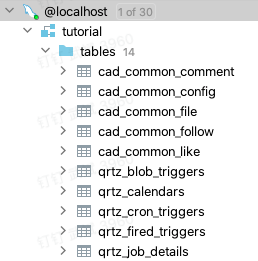<br />首先需要在.env文件中配置数据库连接。
```shell
DB_HOST=localhost
DB_PORT=3306
DB_USER=root
DB_PASSWD=1234
DB_SCHEMA=tutorial
DB_CHARSET=utf8mb4
```
然后我们执行如下命令生成DTO。
```shell
go-doudou ddl --pre=cad_ -r
```

- `--pre`：指定表名前缀，此例中只生成表名以cad_为前缀的表的DTO，可选
- `-r`：逆向生成，表示从数据库表结构生成Go代码，**必须**

执行命令后我们可以看到生成了`dto`包和`entity`包，也就是模型层的表结构映射实体类会同时生成。<br />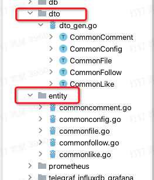<br />`dto`包里有一个`dto_gen.go`文件，加`_gen`后缀是为了与开发者手工创建的文件相区分。<br />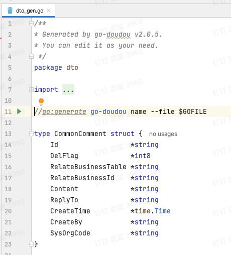<br />第3行的“You can edit it as your need”提示开发者可以自定义修改此文件，重复执行上面的命令不会覆盖开发者手工的修改，因为代码只会增量生成，append到该文件末尾。第11行的go:generate指令后面的代码是go-doudou内置的name工具，用于批量修改结构体的json标签，默认是首字母小写的驼峰命名。截图中的`CommonComment`结构体是表cad_common_comment对应的DTO结构体。<br />需要注意的一点是重复执行上面的命令，会根据数据库表结构映射到`entity`包里的实体类是否存在来决定是否生成DTO结构体。也就是说如果开发者只是把`dto_gen.go`文件或里面的结构体代码删掉，而没有删掉`entity`包里对应的实体类，重复执行上面的命令不会再次生成`entity`包里已经存在的实体类对应的DTO。如果修改了数据库表结构需要重新生成DTO，则`entity`包里对应的实体类和`dto`包里对应的DTO必须成对删掉，再执行上面的命令。
<a name="ghMSQ"></a>
## 2. 新增从Swagger2/Swagger3生成初始化go-doudou项目功能
此功能是指通过兼容Swagger 2或者Swagger 3（OpenAPI 3.0）规范的json文件一把初始化go-doudou微服务项目，主要包括接口定义文件，可以方便从其他框架迁移到go-doudou，如从Java生态的Spring Cloud/Spring boot或者Go生态的beego框架/gin框架等。<br />只需在Swagger文件同路径下执行如下命令即可。
```shell
go-doudou svc init gin2doudou -f gin-admin-swagger.json
```

- `gin2doudou`：指定项目根目录文件夹名称，默认也是go模块名称
- `-f`：指定Swagger文件路径，可以是相对路径，也可以是绝对路径，还可以是下载链接。本示例采用的是知名开源项目[https://github.com/LyricTian/gin-admin](https://github.com/LyricTian/gin-admin)的Swagger文件。

以下是生成的`svc.go`文件的代码截图<br />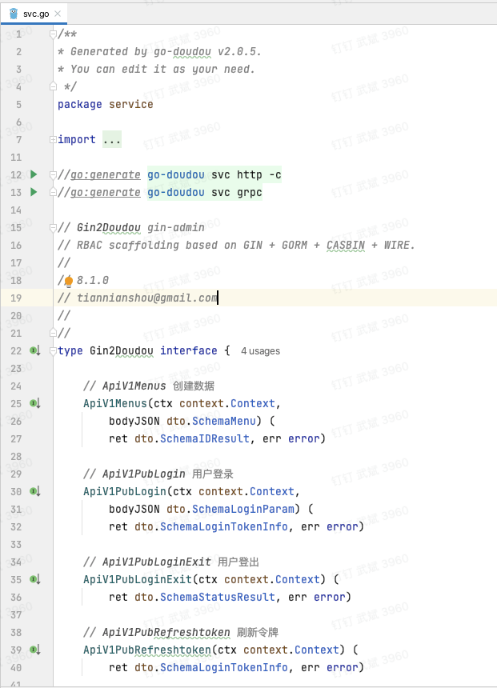<br />点击第13行的绿色三角按钮，可以继续生成Protobuf文件和gRPC打桩代码。<br />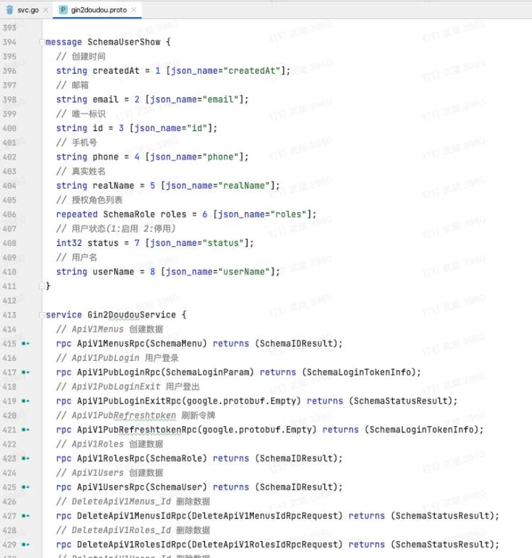<br />点击第12行的绿色run按钮，可以继续生成RESTful服务代码。执行`go run cmd/main.go`即可启动RESTful服务。
```shell
➜  gin2doudou git:(master) ✗ go run cmd/main.go                                                                                          
2023/01/29 11:03:04 maxprocs: Leaving GOMAXPROCS=16: CPU quota undefined
                           _                    _
                          | |                  | |
  __ _   ___   ______   __| |  ___   _   _   __| |  ___   _   _
 / _` | / _ \ |______| / _` | / _ \ | | | | / _` | / _ \ | | | |
| (_| || (_) |        | (_| || (_) || |_| || (_| || (_) || |_| |
 \__, | \___/          \__,_| \___/  \__,_| \__,_| \___/  \__,_|
  __/ |
 |___/
2023-01-29 11:03:04 INF ================ Registered Routes ================
2023-01-29 11:03:04 INF +----------------------------+--------+------------------------------+
2023-01-29 11:03:04 INF |            NAME            | METHOD |           PATTERN            |
2023-01-29 11:03:04 INF +----------------------------+--------+------------------------------+
2023-01-29 11:03:04 INF | ApiV1Menus                 | POST   | /api/v1/menus                |
2023-01-29 11:03:04 INF | ApiV1PubLogin              | POST   | /api/v1/pub/login            |
2023-01-29 11:03:04 INF | ApiV1PubLoginExit          | POST   | /api/v1/pub/login/exit       |
2023-01-29 11:03:04 INF | ApiV1PubRefreshtoken       | POST   | /api/v1/pub/refreshtoken     |
2023-01-29 11:03:04 INF | ApiV1Roles                 | POST   | /api/v1/roles                |
2023-01-29 11:03:04 INF | ApiV1Users                 | POST   | /api/v1/users                |
2023-01-29 11:03:04 INF | DeleteApiV1Menus_Id        | DELETE | /api/v1/menus/:id            |
2023-01-29 11:03:04 INF | DeleteApiV1Roles_Id        | DELETE | /api/v1/roles/:id            |
2023-01-29 11:03:04 INF | DeleteApiV1Users_Id        | DELETE | /api/v1/users/:id            |
2023-01-29 11:03:04 INF | GetApiV1Menus              | GET    | /api/v1/menus                |
2023-01-29 11:03:04 INF | GetApiV1Menus_Id           | GET    | /api/v1/menus/:id            |
2023-01-29 11:03:04 INF | GetApiV1Menustree          | GET    | /api/v1/menustree            |
2023-01-29 11:03:04 INF | GetApiV1PubCurrentMenutree | GET    | /api/v1/pub/current/menutree |
2023-01-29 11:03:04 INF | GetApiV1PubCurrentUser     | GET    | /api/v1/pub/current/user     |
2023-01-29 11:03:04 INF | GetApiV1PubLoginCaptcha    | GET    | /api/v1/pub/login/captcha    |
2023-01-29 11:03:04 INF | GetApiV1PubLoginCaptchaid  | GET    | /api/v1/pub/login/captchaid  |
2023-01-29 11:03:04 INF | GetApiV1Roles              | GET    | /api/v1/roles                |
2023-01-29 11:03:04 INF | GetApiV1Roles_Id           | GET    | /api/v1/roles/:id            |
2023-01-29 11:03:04 INF | GetApiV1Rolesselect        | GET    | /api/v1/rolesselect          |
2023-01-29 11:03:04 INF | GetApiV1Users              | GET    | /api/v1/users                |
2023-01-29 11:03:04 INF | GetApiV1Users_Id           | GET    | /api/v1/users/:id            |
2023-01-29 11:03:04 INF | PutApiV1Menus_Id           | PUT    | /api/v1/menus/:id            |
2023-01-29 11:03:04 INF | PutApiV1PubCurrentPassword | PUT    | /api/v1/pub/current/password |
2023-01-29 11:03:04 INF | PutApiV1Roles_Id           | PUT    | /api/v1/roles/:id            |
2023-01-29 11:03:04 INF | PutApiV1Users_Id           | PUT    | /api/v1/users/:id            |
2023-01-29 11:03:04 INF | GetDoc                     | GET    | /go-doudou/doc               |
2023-01-29 11:03:04 INF | GetOpenAPI                 | GET    | /go-doudou/openapi.json      |
2023-01-29 11:03:04 INF | Prometheus                 | GET    | /go-doudou/prometheus        |
2023-01-29 11:03:04 INF | GetConfig                  | GET    | /go-doudou/config            |
2023-01-29 11:03:04 INF | GetStatsvizWs              | GET    | /go-doudou/statsviz/ws       |
2023-01-29 11:03:04 INF | GetStatsviz                | GET    | /go-doudou/statsviz/*        |
2023-01-29 11:03:04 INF | GetDebugPprofCmdline       | GET    | /debug/pprof/cmdline         |
2023-01-29 11:03:04 INF | GetDebugPprofProfile       | GET    | /debug/pprof/profile         |
2023-01-29 11:03:04 INF | GetDebugPprofSymbol        | GET    | /debug/pprof/symbol          |
2023-01-29 11:03:04 INF | GetDebugPprofTrace         | GET    | /debug/pprof/trace           |
2023-01-29 11:03:04 INF | GetDebugPprofIndex         | GET    | /debug/pprof/*               |
2023-01-29 11:03:04 INF +----------------------------+--------+------------------------------+
2023-01-29 11:03:04 INF ===================================================
2023-01-29 11:03:04 INF Http server is listening at :6060
2023-01-29 11:03:04 INF Http server started in 3.347258ms
```
需要注意的是先执行第12行，则会生成RESTful服务的main函数，如果先执行第13行，则会生成gRPC服务的main函数，已经存在main函数则跳过，go-doudou不会做任何修改。如果希望同时启动RESTful服务和gRPC服务，则需要开发者手工修改main函数，具体代码可参考go-doudou官网的快速上手教程。
<a name="D4srq"></a>
## 3. 新增go语言http客户端自动gzip压缩请求体功能
新增这个特性的目的是为了压缩大size的请求体，加快网络传输速度，提高性能。在go-stats项目里执行`go-doudou svc http -c`，可以生成client包和封装了go-resty的http客户端代码（单元测试文件和代码须开发者自己实现）。<br />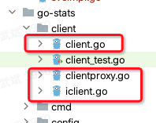<br />跟gzip相关的代码在`client.go`文件的第50行~71行代码。<br />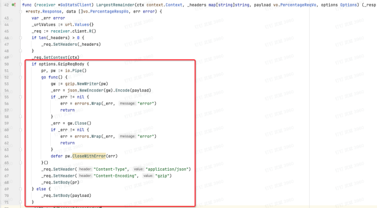<br />相比之前的版本还多了一个`Options`类型的入参，相当于一个开关。调用方在调用客户端方法时可以通过这个开关设置是否压缩请求体。
```go
type Options struct {
    GzipReqBody bool
}
```
<a name="CJdsL"></a>
## 4. 新增自动生成枚举类型实现方法功能
go-doudou提供了枚举类型的支持，要求枚举类型必须实现`IEnum`接口：
```go
type IEnum interface {
	StringSetter(value string)
	StringGetter() string
	UnmarshalJSON(bytes []byte) error
	MarshalJSON() ([]byte, error)
}
```
之前的版本需要开发者手工实现，有了这个新特性以后，可以通过一行命令直接生成代码。<br />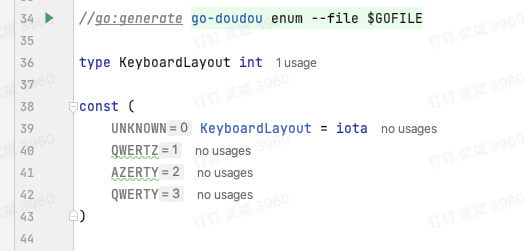<br />如上图所示，可以直接在定义了枚举类型的文件的任意位置写上图中第34行的`//go:generate`指令，再点击绿色三角按钮执行命令。go-doudou会在与原文件同级目录下生成`enums_gen.go`文件。本例中会生成如下代码：
```go
/**
* Generated by go-doudou v2.0.5.
* Don't edit!
 */
package vo

import "encoding/json"

func (k *KeyboardLayout) StringSetter(value string) {
	switch value {
	case "UNKNOWN":
		*k = UNKNOWN
	case "QWERTZ":
		*k = QWERTZ
	case "AZERTY":
		*k = AZERTY
	case "QWERTY":
		*k = QWERTY
	default:
		*k = UNKNOWN
	}
}

func (k *KeyboardLayout) StringGetter() string {
	switch *k {
	case UNKNOWN:
		return "UNKNOWN"
	case QWERTZ:
		return "QWERTZ"
	case AZERTY:
		return "AZERTY"
	case QWERTY:
		return "QWERTY"
	default:
		return "UNKNOWN"
	}
}

func (k *KeyboardLayout) UnmarshalJSON(bytes []byte) error {
	var _k string
	err := json.Unmarshal(bytes, &_k)
	if err != nil {
		return err
	}
	k.StringSetter(_k)
	return nil
}

func (k *KeyboardLayout) MarshalJSON() ([]byte, error) {
	return json.Marshal(k.StringGetter())
}
```
<a name="obkex"></a>
## 5. 新增PathVariable动态路由支持
之前版本一直未支持PathVariable动态路由，因为实际开发中完全可以用查询字符串代替，但为了实现特性2，新增了本特性。<br />本特性主要用在定义服务接口时，可以通过下划线`_`+大写英文字母的方式告诉go-doudou接口方法签名中的哪一部分需要做为PathVariable来生成路由。看个例子马上就理解了。<br />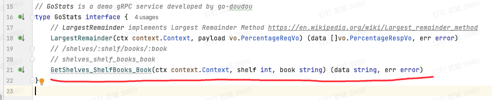<br />如图第21行的代码所示，方法名`GetShelves_ShelfBooks_Book`会生成`/shelves/:shelf/books/:book`的接口路由，包含两个参数：`shelf`和`book`。注意：方法签名里必须传递这两个参数，顺序无所谓，且只能是全英文小写。在生成的`transport/httpsrv/handler.go`文件里可以看到如下代码。<br />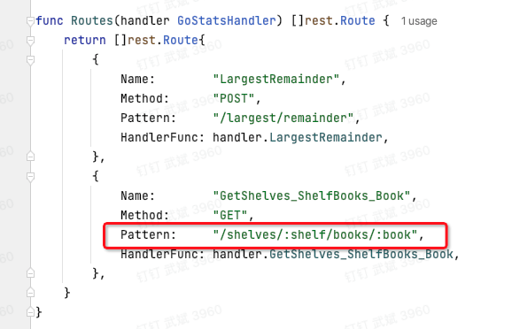
<a name="WL498"></a>
## 6. 新增从Swagger2生成go语言http请求客户端代码功能
go-doudou在内部调用了[https://github.com/getkin/kin-openapi](https://github.com/getkin/kin-openapi)这个库做了Swagger2转Swagger3的处理。
<a name="fD6Mh"></a>
## 7. 新增服务定义对decimal.Decimal类型的支持
本特性对于开发交易或者电商类型的项目比较有用。<br />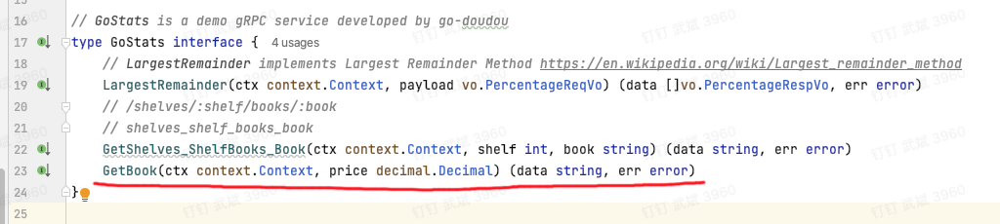<br />如上图所示，服务接口定义里可以定义`decimal.Decimal`类型的入参，在生成`transport/httpsrv/handlerimpl.go`文件里会自动处理该类型参数的解析。<br />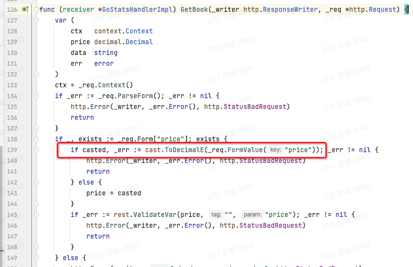<br />核心是调用了cast包的`ToDecimalE`方法。<br />在生成的Swagger文件里，`decimal.Decimal`的参数或者属性会当做string类型处理，也就是说对前端同事来说只是字符串。<br />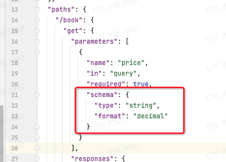<br />结构体`DecimalWrapper`在Swagger里的表示示例：
```go
type DecimalWrapper struct {
	Data decimal.Decimal `json:"data"`
}
```
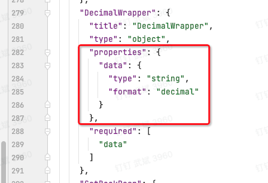
<a name="KpXrJ"></a>
# go-doudou微服务框架
<a name="iYxZc"></a>
## 8. 新增服务端自动gzip解压缩http请求体功能
go-doudou代码仓库的`framework/rest/middleware.go`里新增了`gzipBody`中间件，并默认加进了中间件调用链路中，对开发者透明，开箱即用。该中间件只对http请求头里包含`Content-Encoding`等于`gzip`的请求有效。<br />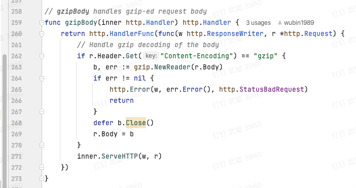
<a name="bSnCO"></a>
## 9. 新增自定义全局PanicHandler功能
go-doudou框架默认加进了recovery中间件，用于从panic中恢复程序，对开发者透明，开箱即用。但是为了方便自定义panic处理，新增了此特性。使用方法如下图所示：<br />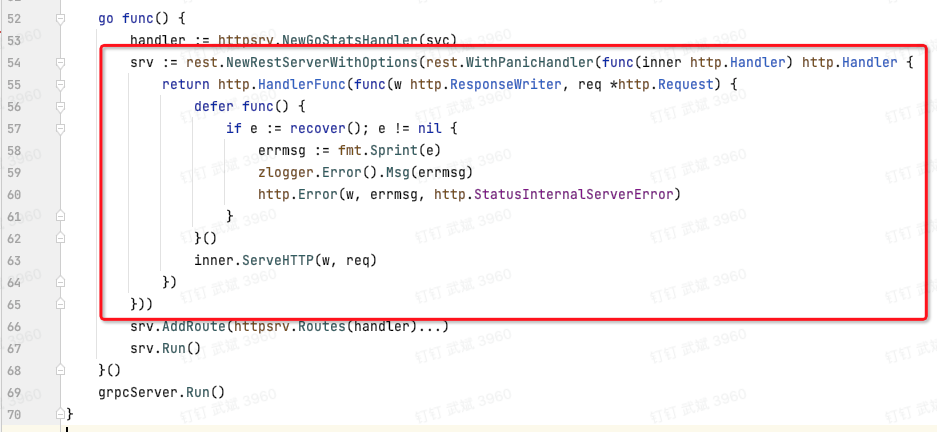<br />只需用`rest.NewRestServerWithOptions`替换之前版本的`rest.NewRestServer()`并传入`rest.WithPanicHandler`的[Functional Options函数](https://golang.cafe/blog/golang-functional-options-pattern.html)即可。

以上，就是go-doudou v2.0.5版本新增特性的介绍，有任何疑问都可以随时私信我。
